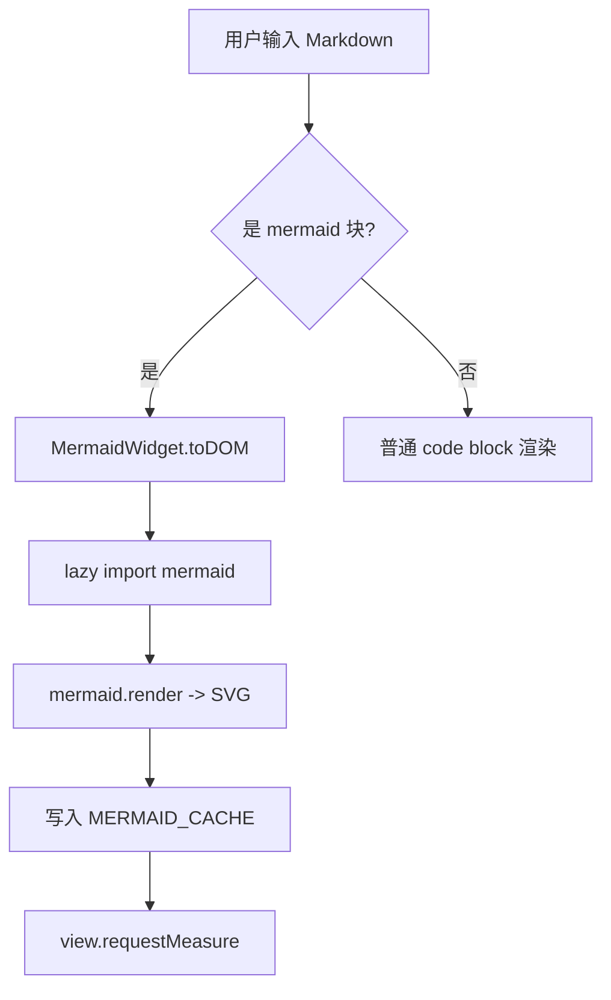
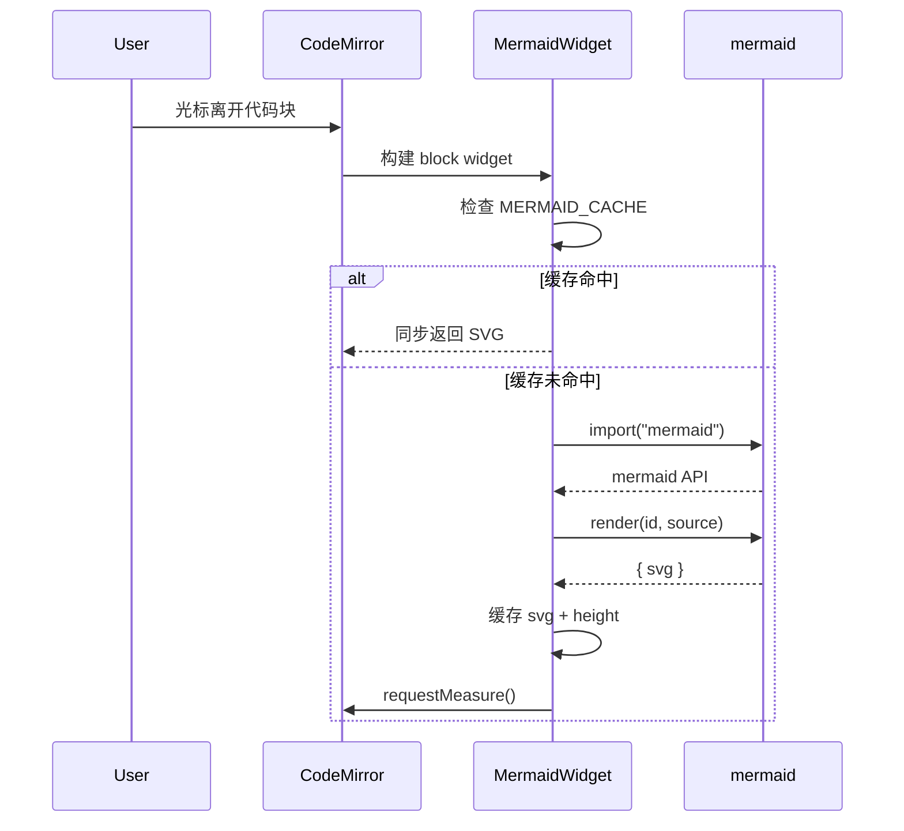
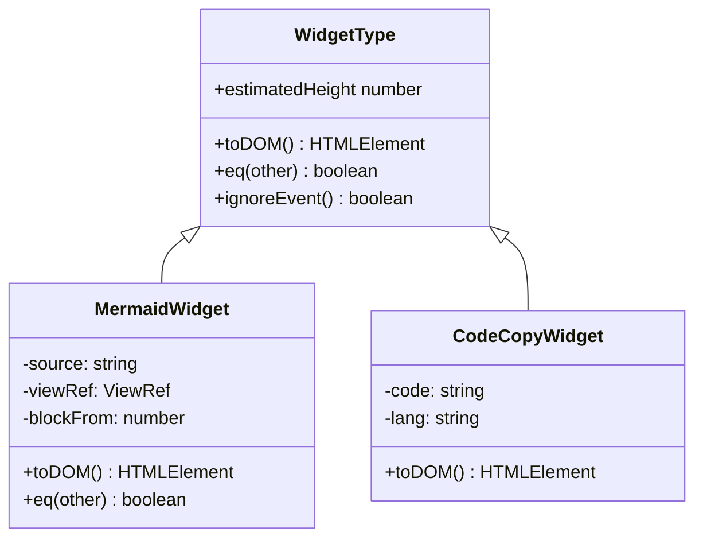
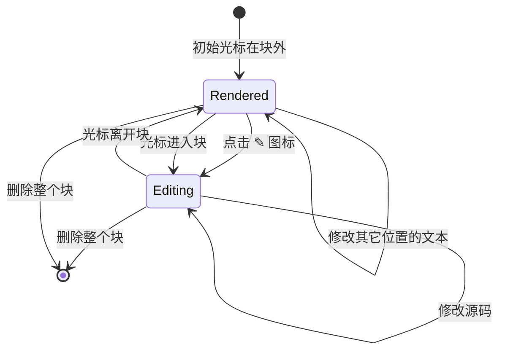
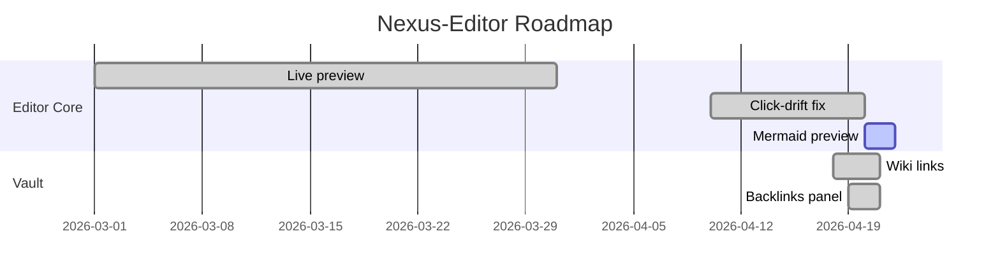
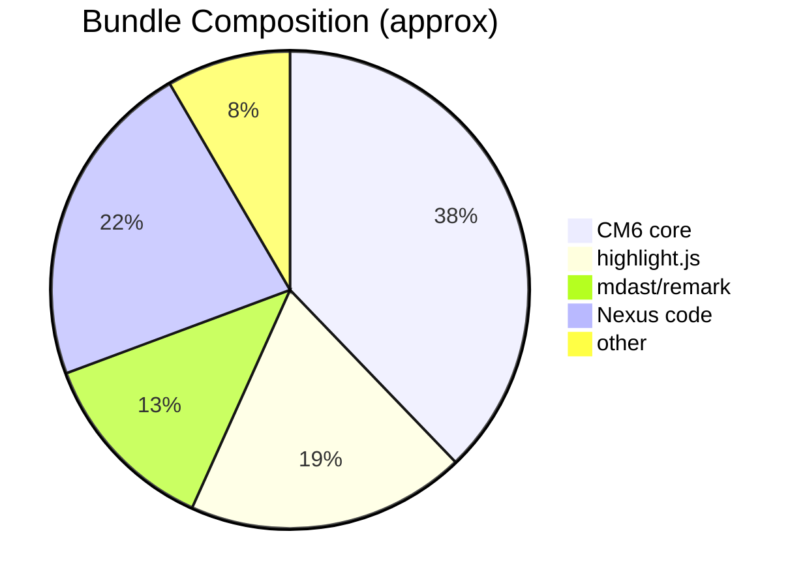
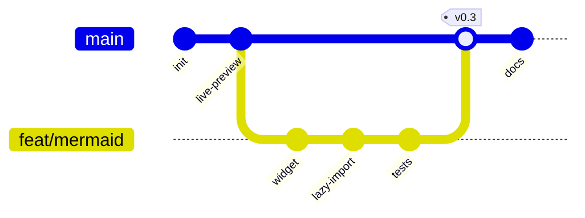

# Mermaid Diagram Demo

这个文档用来验证 `@nexus/core` 的 mermaid 渲染能力。光标离开代码块就会看到渲染好的图；
点右上角的 ✎ 图标可以进入编辑模式；光标再离开就会自动回到渲染态。

## 1. Flowchart — 简单流程图



## 2. Sequence Diagram — 时序图



## 3. Class Diagram — 类图



## 4. State Diagram — 状态机



## 5. Gantt — 项目排期



## 6. Pie — 饼图



## 7. Git Graph — 分支图



## 语法错误兜底

故意写错一个，应该看到红色错误条而不是白屏：

```mermaid
graph TD
    this is intentionally broken >>>
```

---

回 [[index]] ｜ 相关代码：`packages/core/src/live-preview.ts` 的 `MermaidWidget`
